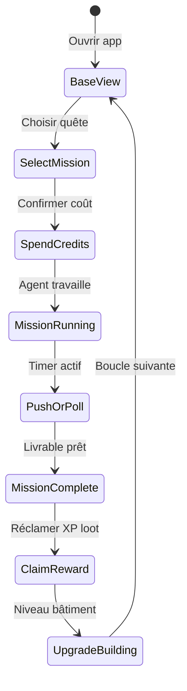

# Boucle de jeu principale

## Résumé

L'utilisateur ne « configure un SaaS » : il **joue** une boucle **Trigger → Mission → Timer → Résultat → Récompense → Upgrade**, calquée sur Clash of Clans + quêtes RPG, branchée sur de vrais agents backend.

## Diagramme

## Étapes détaillées

| Étape | Jeu | Business réel | Données |
|-------|-----|---------------|---------|
| **1. Trigger** | Notification « Ta forge a fini » / barre d'énergie pleine | Mission terminée ou crédits rechargés | Push, badge, streak |
| **2. Mission** | Choisir une quête sur la carte ou au bâtiment | Tâche agent : landing, ads, research | `MissionType`, `agent_id`, `input` |
| **3. Spend credits** | Coût en gems/énergie affiché avant validation | Budget compute + API | `credits_cost`, wallet débité |
| **4. Timer** | Barre de progression, animation travailleur | Job async 2–15 min | `started_at`, `estimated_duration` |
| **5. Result** | Écran « loot » avec carte récompense | JSON/markdown livrable | `deliverable`, `artifacts[]` |
| **6. Reward** | +XP, +gold jeu, déblocage | Métriques business optionnelles | `xp_gained`, `company_level` |
| **7. Upgrade** | Bâtiment passe niveau 2 → missions plus rapides/chères | Capacités agent (meilleur modèle, plus de tokens) | `building_level` |

## Règles d'équilibrage MVP

- **Énergie gratuite** : 50 crédits/jour (regen à minuit UTC).
- **Coût mission** : Builder 15, Marketer 20, Researcher 10 crédits.
- **Durée** : 3 min (dev mock) à 10 min (agent réel selon charge).
- **XP** : `floor(credits_spent * 1.5)` par mission réussie.
- **Level company** : `level = floor(sqrt(total_xp / 100)) + 1`.

## Hook Model (rétention)

| Phase | Implémentation |
|-------|----------------|
| Trigger externe | Push mission terminée, streak quotidien |
| Trigger interne | Curiosité du loot, FOMO timer bâtiment |
| Action | 1 tap « Lancer quête » depuis base |
| Récompense variable | Qualité livrable, bonus XP aléatoire 10 % |
| Investissement | XP permanent, niveau bâtiment, collection agents |

## Événements analytics (à instrumenter)

- `mission_started`, `mission_completed`, `mission_failed`
- `credits_spent`, `credits_purchased` (IAP)
- `building_upgraded`, `agent_recruited`
- `deliverable_viewed`, `deliverable_shared`

## API correspondante

Voir `backend/app/api/v1/missions.py` et modèles `Mission`, `Company`, `Wallet`.
