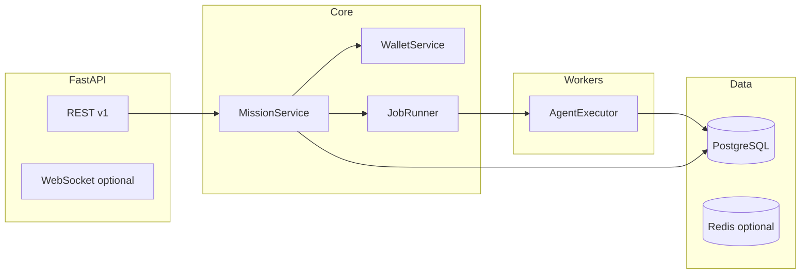

# Architecture backend — orchestrateur

## Vue d'ensemble



## Modèle de données (MVP SQLite/Postgres)

- **users** — `id`, `device_id` ou `apple_sub`
- **companies** — `id`, `user_id`, `name`, `mission_statement`, `level`, `xp`
- **wallets** — `company_id`, `credits_balance`, `daily_credits_claimed_at`
- **buildings** — `company_id`, `agent_type`, `level`
- **missions** — `id`, `company_id`, `agent_type`, `mission_type`, `status`, `credits_cost`, `deliverable`, timestamps
- **mission_logs** — audit trail par étape agent
- **agent_runs** — tokens, model, sandbox flag

## Cycle de vie mission

```
pending → running → completed | failed
```

1. `POST /v1/companies/{id}/missions` — vérifie crédits, débite wallet, crée mission `pending`.
2. Background task — passe `running`, append logs, appelle agent.
3. Succès — stocke `deliverable`, crédite XP, notifie (push hook stub).
4. Échec — rembourse 50 % crédits (politique MVP), log erreur.

## Crédits & budget

- Débit atomique dans transaction DB.
- `daily_regen` : si `last_regen < today`, balance = min(balance + 50, cap 100).
- IAP futur : endpoint `POST /v1/wallet/purchase` (receipt Apple) — stub en MVP.

## Sandbox & sécurité

- Agents n'exécutent **pas** de shell arbitraire en MVP.
- Sortie = texte/HTML/JSON généré uniquement.
- `max_output_tokens` par mission.
- Rate limit : 10 missions/heure/company.

## Observabilité

- `mission_logs` : chaque étape (`debited`, `agent_started`, `agent_completed`).
- Structured logging JSON via `structlog`.
- Health : `GET /health`.

## Déploiement cible

- Docker Compose : `api` + `postgres` (+ `redis` Phase 2).
- Render/Railway pour API ; Neon Postgres.

## Fichiers

```
backend/app/
  main.py
  core/config.py
  core/database.py
  models/
  schemas/
  services/wallet.py
  services/mission.py
  services/company.py
  agents/
  api/v1/
  workers/runner.py
```
